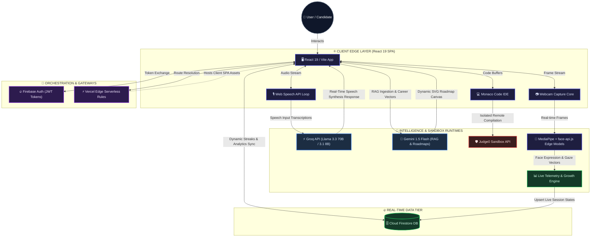
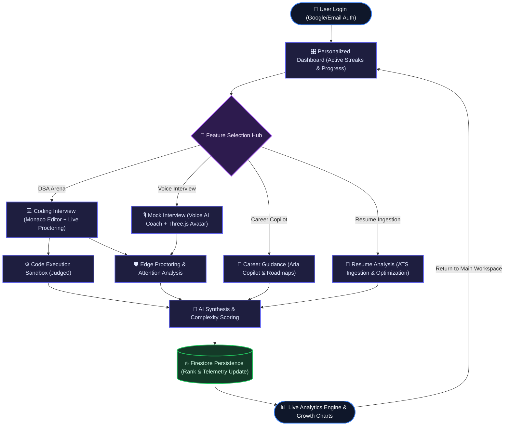
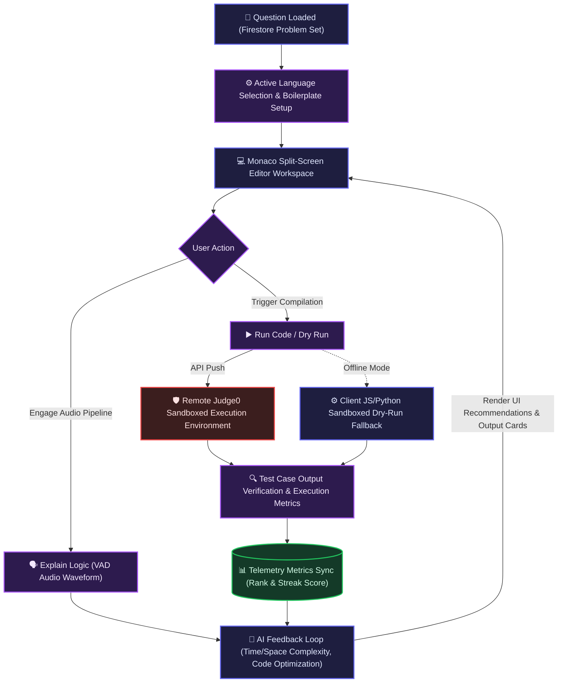
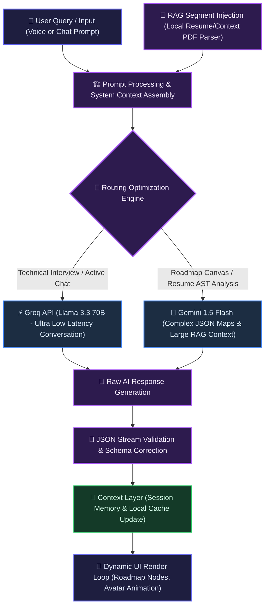
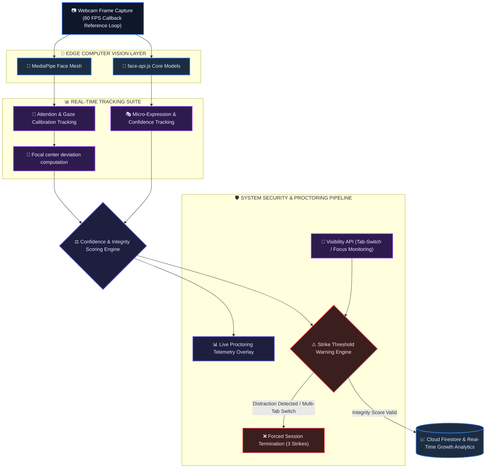
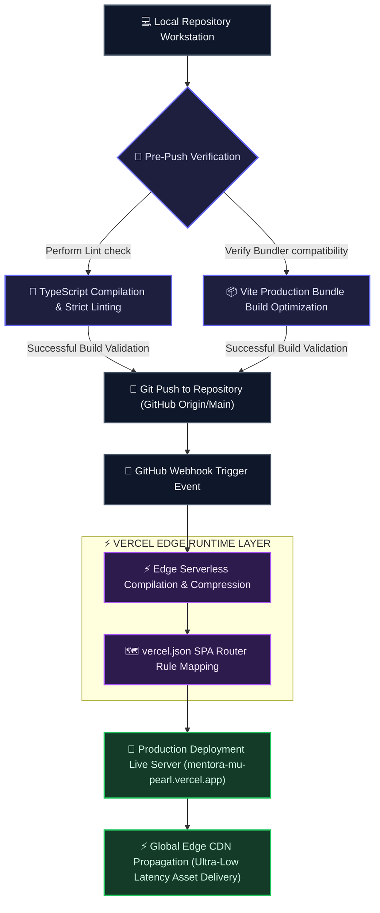

<div align="center">

# 🎓 MENTORA AI

### Production-Grade, Low-Latency Gamified AI Career Copilot & Technical Preparation Suite

<a href="https://github.com/jyantparashar/Mentora">
  
</a>

[](https://www.typescriptlang.org/)
[](https://react.dev/)
[](https://firebase.google.com/)
[](https://groq.com/)
[](https://ai.google.dev/)
[](https://threejs.org/)
[](https://vercel.com/)

<br/>

> **Mentora AI** is an advanced, edge-optimized, and gamified AI career ecosystem designed to bridge the gap between academic preparation and elite industry employment. Featuring an ultra-low-latency, real-time voice synthesis loop, WebGL holographic canvas rendering, computer-vision proctoring systems, fully isolated compiler sandboxing (via Judge0), and AST-optimized resume intelligence, Mentora AI provides candidates with an immersive FAANG-fidelity preparation arena.

### 🌐 [Launch Mentora AI Live on Vercel](https://mentora-mu-pearl.vercel.app)

---

</div>

## 🏗️ 1. SYSTEM ARCHITECTURE FLOW

Mentora AI is architected with a decoupled, high-performance multi-tier pipeline. Client-side workloads leverage edge processing (using MediaPipe Web workers for video inference and browser Web Speech APIs), while computationally intensive compiles and AI operations flow through specialized external execution engines and low-latency API routers.



---

## 🗺️ 2. USER FLOWCHART (Candidate Journey Map)

The user journey is fully gamified and mapped, directing candidates from high-security authentication panels into a comprehensive analytics loop. Learning metrics feed back into Firestore in real time, driving streak tallies and career level advancement.



---

## 💻 3. CODING INTERVIEW SANDBOX FLOW

The Coding Interview workspace splits high-performance operations between real-time browser rendering (Monaco IDE layout buffers and local logic explanations) and microsecond compilation calls executed inside secure remote runtime sandboxes.



---

## 🧠 4. DUAL AI PIPELINE & RAG CONTEXT INGESTION

Mentora AI integrates a hybrid model strategy to achieve optimal efficiency. Voice processing utilizes ultra-low latency configurations, while deep technical analysis and AST parsing run over highly context-rich vector segments.



---

## 🧬 5. EDGE COMPUTER VISION & ATTENTION PROCTORING FLOW

Proctoring is performed natively on the user's hardware via client-side face landmark mesh grids, gaze angle vectors, and expression matrices. Local loops avoid constant server roundtrips, reducing CPU load while securing session integrity.



---

## 📦 6. GIT-OPS CONTINUOUS DEPLOYMENT FLOW

Deployments utilize pre-push scripts to ensure zero-latency client failures, routing build-time output targets straight through Vercel's global serverless pipeline for immediate edge deployment.



---

## 🛠️ CORE COMPONENT DEEP-DIVE

### 1. 🤖 Career Copilot & Counselor (Aria)
Aria functions as a conversational career coach leveraging Google Gemini's dense context windows:
- **Mobile-Responsive Slit Architecture:** Uses responsive flex containers (`flex-col lg:flex-row`) to dynamically shift layout structures. An elegant, custom-designed sliding toggle tab switcher resolves mobile z-index overlap, preventing viewport squeezing.
- **Dynamic Context Injection:** Takes uploaded candidate resumes, parses content into distinct chunks, and embeds vector reference matrices into Gemini prompts for instantaneous personalized counseling.
- **SVG Pathing Engine:** Transforms long-term occupational goals into highly stylized interactive roadmap nodes rendered cleanly on a reactive SVG canvas.
- **Cross-Platform Resilient Voice Assistant:** Incorporates strict checks safeguarding the Web Speech API on mobile devices and legacy browsers. Employs event-driven voice list loading alongside fallback timers for the `voiceschanged` event, preventing lifecycle crashes while ensuring high-fidelity, female-preferred synthesizer fallback even under network latency.

### 2. 🎙️ Holographic Voice Interview & Proctoring Core
Provides a premium real-time behavioral mock interview environment utilizing state-of-the-art sensory synchronization:
- **Pre-Interview Readiness Check & Camera Mirroring:** Requires active hardware permissions before session start. Features a beautiful checklist checking ✔ Camera, ✔ Microphone, and ✔ Voice assistant readiness alongside a live, mirrored webcam video feed.
- **Flicker-Free & Blackout-Proof Camera Stream:** Employs dynamic **React Callback Refs** to bind stream tracks the split second the video component mounts to the DOM. This completely prevents lifecycle-induced camera blackouts and isolates the stream from standard React render cycles.
- **Exponentially Weighted Moving Average (EWMA) Telemetry:** Implements real-time EWMA smoothing:
  $$S_t = (0.8 \times S_{t-1}) + (0.2 \times X_t)$$
  This guarantees realistic, smooth behavioral score transitions. Inactive camera states dynamically transition telemetry indicators to placeholder indicators (`—`) rather than pinning artificial values.
- **Weighted Analytics Integrity Index:** Consolidates raw tracking telemetry into a mathematically rigorous behavior index:
  - **Eye Contact:** 30%
  - **Attention (Focus):** 25%
  - **Face Presence:** 20%
  - **Expression Stability:** 10%
  - **Tab Switching Integrity:** 15%
- **Relaxed Natural Gaze tolerances:** Calibrates candidate look-away vectors dynamically. Dead-zones are set to a generous `0.24` horizontal and `0.22` vertical coordinate range to accommodate natural thinking gestures, with distraction alerts delayed until **20 continuous frames (~6 seconds)** of lost focus are sustained.
- **Strict 3-Strike Tab-Switch Proctoring:** Tracks system visibility focus losses. Triggers an ambient warnings card on Strike 1, a serious CTA dialog requiring manual resolution on Strike 2, and terminates the interview saving zero score credit on Strike 3.

### 3. 💻 3-Column Monaco DSA Arena
A production-fidelity IDE optimized for deep computational review:
- **High-Density Desktop Layout:** 
  - **Left:** Interactive markdown instructions, Voice Activity Detection timers, and audio controls.
  - **Center:** High-performance Monaco editor configured with automatic bracket colorization, strict schema checking, and auto-completions.
  - **Right:** Proctor HUD displaying live webcam feed, real-time focus metric dials, gaze vectors, and warning tallies.
- **Judge0 Compile Sandbox:** Transmits editor code buffers directly to a secure, isolated sandbox for rigorous test case validation. Incorporates a client-side JS/Python interpreter sandbox to serve as an instant dry-run fallback during network latency.
- **GPU-Optimized WebGL Canvas:** Avatar dimensions are locked to explicit display box bounds (`size={160}`), reducing context compute overhead and maintaining a smooth 60 FPS under intensive compilation stress.

### 4. 📄 ATS Resume Intelligence
- **Automated AST Profile Analyzer:** Parses and tokenizes uploaded resumes, compiling structural nodes and cross-referencing them against targeted role descriptions to calculate compatibility percentages.
- **AST Optimization Engine:** Pinpoints syntax, structural gaps, and missing technical keywords, offering instant, recruiter-friendly replacements to pass ATS parsers.

### 5. 📈 Live Telemetry & Growth Dashboard
- **Active Telemetry Hook:** Captures keystrokes, frame focus state, dynamic mouse gestures, and active tab time to log accurate study and concentration metrics.
- **Firestore Synchronization:** Replicates learning metrics, current level progress, and active daily streaks into Firestore databases, rendering responsive progress rings in the dashboard UI.
- **Interactive Circadian-Responsive AI Greetings:** Spawns a sleek, glassmorphic toast notification component (`AIGreeting.tsx`) exactly 1.2 seconds post-boot. The greeting leverages circadian rules (Midnight Grind, Sunrise Stride, High-Noon Momentum, Evening Deep-Focus) to present tailored micro-action suggestions based on active Firestore metrics, including daily preparation streaks, weak topics, and total sessions.

### 6. 🔐 Secure Account Deletion Flow & Data Purge
Enforces ironclad account deletion protocols directly linked to cloud storage:
- **Multi-Provider Safety Re-Authentication:** For users authenticated via standard Email/Password accounts, forces safety password checks by invoking `reauthenticateWithCredential` on Firebase prior to deletion, preventing Session Hijacking attacks.
- **Cascading Database Cleanup:** Initiates parallel Firestore queries to cleanly wipe associated records (personalized roadmaps, historical interview sessions, DSA compilation telemetry logs) in parallel batches prior to deletion, preventing orphaned cloud database items.
- **UI Destructive Lock:** Outlines precise security warnings within a dedicated, rose-bordered warning modal with active loader state checks, blocking deletion requests unless all provider validation requirements are completed.

---

## 📁 REPOSITORY DIRECTORY STRUCTURE

```filepath
Mentora/
├── public/                       # Global static assets, face models, Three.js shaders
├── src/
│   ├── react-app/
│   │   ├── components/
│   │   │   ├── counselor/        # Aria Chat elements, Suggested action nodes
│   │   │   ├── dashboard/        # WelcomeHero, Streak modules, progression panels
│   │   │   ├── interview/        # Three.js holographic engine, Face-API video loops
│   │   │   ├── layout/           # Expandable SaaS Sidebar, Mobile bottom navigation
│   │   │   └── ui/               # RAG PDF upload modules, AIGreeting dynamic toast, micro-interaction wrappers
│   │   ├── lib/
│   │   │   ├── auth.tsx          # Firebase authentication session contexts
│   │   │   ├── counselor.ts      # Multi-stage custom prompts & system directives
│   │   │   ├── db.ts             # Cloud Firestore read/write operations
│   │   │   ├── gemini.ts         # LLM streams, response validation parsing
│   │   │   ├── jobsearch.ts      # Live aggregator API routes (LinkedIn/Glassdoor)
│   │   │   ├── notifications.tsx # Customized glassmorphic toast notification modules
│   │   │   ├── rag.ts            # Text chunk tokenizers and local vector helpers
│   │   │   ├── realtime.ts       # Telemetry calculators & database synchronization
│   │   │   └── theme.tsx         # Sleek dark mode / theme-switching controls
│   │   ├── pages/
│   │   │   ├── Auth.tsx          # Animated authentication drawer & social sign-in
│   │   │   ├── CareerCounselor.ts# Aria Copilot, Mobile Layout switcher, Job Finder
│   │   │   ├── Copilot.tsx       # Lazy-loaded page wrapper
│   │   │   ├── DSAMentor.tsx     # 3-Column Monaco Workspace & Sandboxed compiler
│   │   │   ├── Home.tsx          # Unified student metrics & action center
│   │   │   ├── Profile.tsx       # Developer skills, years of prep & rank status
│   │   │   └── Progress.tsx      # SVG chart reports, learning speed analysis
│   │   ├── index.css             # Vanilla CSS core design system tokens & keyframes
│   │   └── main.tsx              # Main system bootstrapping index
├── vercel.json                   # SPA edge routing and cache policy directives
├── vite.config.ts                # Hot Module Replacement & production bundle configs
└── package.json                  # Strict dependencies registry
```

---

## 🛠️ STACK ARCHITECTURE

- **Frontend Core:** React 19 Single Page Application (Strict Mode)
- **Language Compiler:** TypeScript 5.8 (Strict Type Evaluation)
- **Computer Vision Pipeline:** face-api.js & MediaPipe Tasks Vision Web Workers
- **Styling Paradigm:** Tailwind CSS v4 & custom Vanilla CSS keyframe layers
- **Data & Identity:** Firebase Authentication & Cloud Firestore (Real-Time Observers)
- **Build Orchestrator:** Vite & Rollup Production Compiler
- **3D Render Interface:** Three.js / WebGL Contexts
- **Secure Sandboxed Runtimes:** Judge0 Compiler & Interpreter APIs

---

## ⚙️ DEVELOPMENT QUICK-START

Follow this protocol to construct a local workstation instance of Mentora AI:

### Prerequisites
- **Node.js** (v20+ LTS recommended)
- A **Firebase Project** with Email/Password & Google OAuth enabled
- A **Groq Cloud API Key** ([console.groq.com](https://console.groq.com/))
- A **Google Gemini API Key** ([aistudio.google.com](https://aistudio.google.com/))

### 1. Repository Setup
```bash
git clone https://github.com/jyantparashar/Mentora.git
cd Mentora
npm install
```

### 2. Environmental Initialization
Create a `.env` file in the root workspace directory:
```env
VITE_FIREBASE_API_KEY=your_firebase_api_key
VITE_FIREBASE_AUTH_DOMAIN=your_firebase_auth_domain
VITE_FIREBASE_PROJECT_ID=your_firebase_project_id
VITE_FIREBASE_STORAGE_BUCKET=your_firebase_storage_bucket
VITE_FIREBASE_MESSAGING_SENDER_ID=your_firebase_messaging_sender_id
VITE_FIREBASE_APP_ID=your_firebase_app_id
VITE_FIREBASE_MEASUREMENT_ID=your_firebase_measurement_id
VITE_GROQ_API_KEY=your_groq_api_key
VITE_GEMINI_API_KEY=your_gemini_api_key
```

### 3. Execution Command
Start the local hot-reloading development server:
```bash
npm run dev
```
Open your browser to [http://localhost:5173](http://localhost:5173).

---

## 🚀 PRODUCTION PRODUCING (VERCEL EDGE DEPLOYMENT)

Mentora AI is optimized to compile into single-bundle targets mapped for Vercel's global CDN distribution:

### Deployment Checklist
1. **Routing:** Ensure [`vercel.json`](file:///Users/jayantparashar/Downloads/Mentora/vercel.json) lists strict fallback redirect arrays to `index.html` to avoid 404 client crashes under remote direct links.
2. **Environment Variables:** Add all system production keys into the Vercel Dashboard project settings.
3. **Execution Command:** Deploy locally linked assets to the live prod edge:
   ```bash
   vercel --prod
   ```

---

## 🤝 CONTRIBUTIONS & CODE OF CONDUCT

We value active contribution to the Mentora AI project:
1. **Fork** the repository workspace.
2. Create your engineering branch: `git checkout -b feature/AmazingUpgrade`
3. Commit validated changes: `git commit -m "feat: Add core execution fallback optimizations"`
4. Push upstream: `git push origin feature/AmazingUpgrade`
5. Initiate a **Pull Request** detailing changes, compile logs, and visual updates.

---

<div align="center">

**Crafted with Passion & High-Fidelity Engineering by [Jayant Parashar](https://github.com/jyantparashar)**  
📧 **Contact Inquiry:** [jyantsharma45@gmail.com](mailto:jyantsharma45@gmail.com)

*© 2025-2026 Jayant Parashar. All rights reserved.*

[](https://github.com/jyantparashar)

</div>
